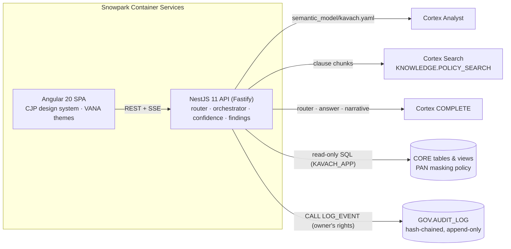

# 🛡️ Kavach (कवच): Governed Risk, Fraud & Regulatory Intelligence Copilot

> Plain-English questions in. **Cited, audit-ready findings** out, built entirely on **Snowflake Cortex**.

Kavach is a copilot for an NBFC's risk, fraud and compliance teams. Ask *"Show me accounts flagged for structuring this week, and what does our AML policy require us to do about them?"* and Kavach will:

1. **route** the question (data, policy or both) with Cortex COMPLETE,
2. pull **governed data** through **Cortex Analyst** (semantic model + verified queries) and show the SQL,
3. retrieve the **exact clauses** from RBI directions and internal SOPs through **Cortex Search**,
4. write an answer where **every sentence is cited** (`[D1]`, `[P1]`…), with a rule-based **confidence badge**,
5. turn it into a **case note / exception report / STR draft** in one click,
6. capture **maker-checker sign-off**, and
7. append every step to a **SHA-256 hash-chained audit log** you can verify with one SQL query.

Snowflake CoCo CLI Hackathon 2026 (GCC Edition), Challenge 1. Prototype documentation: [docs/MVP_DOCUMENTATION.md](docs/MVP_DOCUMENTATION.md) · Demo script: [docs/DEMO_SCRIPT.md](docs/DEMO_SCRIPT.md)

---

## Architecture



| Folder | What |
|---|---|
| `web/` | Angular 20 standalone app (signals, SCSS). Visual language from the CJP credit-score page; themes and effects from VANA |
| `api/` | NestJS 11 + Fastify API. Snowflake over REST (SQL API, Cortex Analyst, Cortex Search); offline mock backend |
| `sql/` | Numbered Snowflake scripts: setup, tables, load, views, Cortex Search, governance, live alerts, SPCS |
| `semantic_model/` | Cortex Analyst semantic model with verified queries |
| `corpus/` | Policy and regulation corpus (paraphrased RBI summaries + fictional internal policies) |
| `data/` | Deterministic synthetic-data generator and generated CSVs |
| `deploy/spcs/` | SPCS service specification |
| `docs/` | MVP documentation and demo script |

## Quick start (offline, no Snowflake needed)

```bash
# API with the mock backend (reads data/out/*.csv, same contract as Snowflake)
cd api && npm ci && npm run build && npm run start:mock        # http://localhost:8080

# Web app (dev server proxies /api to :8080)
cd web && npm ci && npm start                                  # http://localhost:4200
```

Or run everything from one container: `docker build -t kavach . && docker run -p 8080:8080 -e KAVACH_BACKEND=mock kavach`.

## Voice

Press the mic button (or **V**) and speak. The transcript streams into the box, and a pause of about 2 seconds sends it. Answers are only read aloud when you turn on **Read answers aloud** (off by default); the 🔊 Listen button on any answer reads it on demand.

Spoken commands act on the current result: *"generate case note"*, *"draft STR"*, *"exception report"*, *"read it"*, *"stop"*, *"open alerts / findings / audit"*, *"new investigation"*. Anything else is treated as a question.

Voice uses the browser's Web Speech API (as in VANA) and works in Chrome, Edge and Safari. In Chrome, speech is transcribed by the browser vendor's cloud service, so keep real customer identifiers out of spoken questions.

## Deploy on Snowflake

Step-by-step guide with smoke tests and troubleshooting: **[docs/SNOWFLAKE_SETUP.md](docs/SNOWFLAKE_SETUP.md)**. Run `cd api && npm run check:snowflake` to verify every Cortex service before starting the app.

**1. Provision objects and data**

```bash
pip install snowflake-cli            # or: brew install snowflake-cli
snow connection add                  # one-time
SNOW_CONNECTION=<name> ./scripts/deploy.sh
```

This runs `sql/00`–`06`: roles (`KAVACH_ADMIN`, `KAVACH_APP`), the `KAVACH_WH` warehouse, tables and synthetic data, the `STRUCTURING_SIGNALS` view, the Cortex Search service, the audit log, and the optional alert simulator. It also uploads `semantic_model/kavach.yaml`.

**2. Run the app inside Snowflake (SPCS)**

Follow `sql/07_spcs_deploy.sql`: create the image repository and compute pool, `docker build --platform linux/amd64`, push, then `CREATE SERVICE`. `SHOW ENDPOINTS IN SERVICE` gives the public URL. Snowflake handles authentication, and the signed-in user is recorded in every audit event.

**3. Or run locally against Snowflake**

Copy `api/.env.example` to `api/.env` and set `SNOWFLAKE_HOST` plus either `SNOWFLAKE_PAT` (programmatic access token) or key-pair (`SNOWFLAKE_ACCOUNT`, `SNOWFLAKE_USER`, `SNOWFLAKE_PRIVATE_KEY_PATH`). Then `KAVACH_BACKEND=snowflake npm start`.

> PATs may require the user to be covered by a network policy, depending on account settings. Key-pair auth avoids this.

On demo day: `CALL KAVACH.CORE.REBASE_DATES();` shifts the synthetic dates so "this week" means this week.

## Governance controls

| Control | Where |
|---|---|
| Read-only SQL guard (single `SELECT`/`WITH` only) | `api/src/kavach/sql-guard.ts` |
| App role has `SELECT` only; audit writes go through one owner's-rights procedure | `sql/05_governance.sql` |
| SHA-256 hash chain + verification view | `KAVACH.GOV.V_AUDIT_CHAIN_CHECK` |
| PII masking: the LLM path never sees raw PAN | `KAVACH.CORE.PAN_MASK` |
| One governed definition of "structuring" | `KAVACH.CORE.STRUCTURING_SIGNALS` + semantic model |
| Rule-based confidence (empty data, weak retrieval, bogus or missing citations) | `api/src/kavach/orchestrator.service.ts` |
| Deterministic finding header and evidence appendix | same |
| Maker-checker sign-off recorded as its own audit event | `V_FINDINGS.maker_checker_ok` |
| Governed query-expansion glossary for retrieval | `api/src/kavach/config.ts` |

```sql
-- Prove nothing was tampered with
SELECT * FROM KAVACH.GOV.V_AUDIT_CHAIN_CHECK WHERE NOT is_valid;   -- expect 0 rows
```

## Tests

```bash
cd api && npm test      # orchestrator, retrieval quality, hash chain + tamper detection, SQL API decoding, JWT, e2e HTTP
cd web && npx ng build  # type-checked production build
```

## Data and content disclaimer

All customer, loan and transaction data is **synthetic**. The RBI documents in `corpus/` are **paraphrased summaries written for this demo**, and their section numbers are the summaries' own. Verify every obligation against the official RBI text before relying on it. "DemoLend NBFC" and its policies are fictional.
